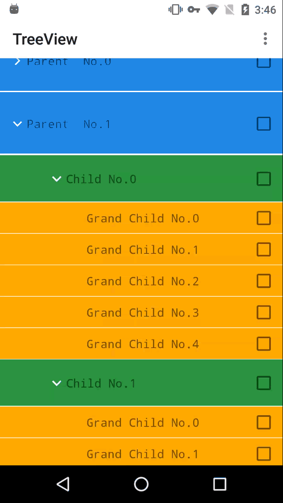
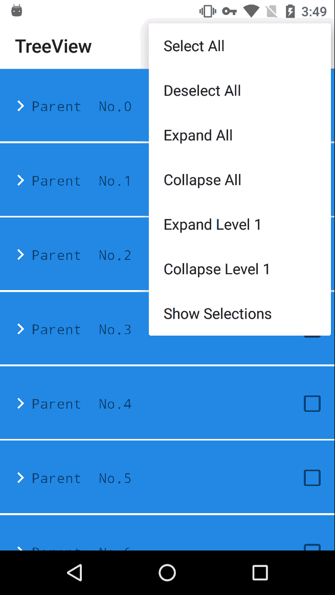

## TreeView
An android tree view with high performance and rich functions 

[中文介绍](http://texy.me/2017/05/01/android_tree_view/)

### Captures
There are some gifs from Demo:

* Select node:


* Operate all:


### Features
- expandAll/collapseAll
- expandNode/collapseNode
- expandLevel/collapseLevel
- toggleNode
- deleteNode/addNode
- selectNode/deselectNode
- selectAll/deselectAll
- getAllSelectedNodes

Now supports [sevar83's IndeterminateCheckBox](https://github.com/sevar83/indeterminate-checkbox) as well as Android's android.widget.CheckBox

### Usage
**1.Reference the library from your module's build.gradle:**
```groovy
compile 'me.texy.treeview:treeview_lib:1.0.3'
```
**2.Implement your all level's BaseNodeViewBinder**

Sample：
```java
public class FirstLevelNodeViewBinder extends BaseNodeViewBinder {
  TextView textView;
  public FirstLevelNodeViewBinder(View itemView) { 
    super(itemView);  
    textView = (TextView) itemView.findViewById(R.id.node_name_view)
  }
  
  @Override
  public int getLayoutId() {
    return R.layout.item_first_level;
  }
  
  @Override
  public void bindView(TreeNode treeNode) {
    textView.setText(treeNode.getValue().toString());
  }
}

SecondLevelNodeViewBinder
ThirdLevelNodeViewBinder
.
.
.
```
If you want add the selectable feature,replace BaseNodeViewBinder with CheckableNodeViewBinder.

**3.Implement the BaseNodeViewFactory**

Sample：
```java
public class MyNodeViewFactory extends BaseNodeViewFactory {
  @Override
  public BaseNodeViewBinder getNodeViewBinder(View view, int level) {
    switch (level) {
      case 0:
        return new FirstLevelNodeViewBinder(view);
      case 1:
        return new SecondLevelNodeViewBinder(view);
      case 2:
        return new ThirdLevelNodeViewBinder(view);
      default:
        return null;
    }
  }
}
```
If you do not want to create a class file,just implement a anonymous inner class in TreeView's constructor

**4.Add TreeView to wherever you want**

Sample:
```java
TreeNode root = TreeNode.root();
//build the tree as you want
for (int i = 0; i < 5; i++) {
  TreeNode treeNode = new TreeNode(new String("Child " + "No." + i));
  treeNode.setLevel(0);
  root.addChild(treeNode);
}
View treeView = new TreeView(root, context, new MyNodeViewFactory()).getView();
//add to view group where you want 
```

### License

    Copyright 2017 shineM.

    Licensed under the Apache License, Version 2.0 (the "License");
    you may not use this file except in compliance with the License.
    You may obtain a copy of the License at

       http://www.apache.org/licenses/LICENSE-2.0

    Unless required by applicable law or agreed to in writing, software
    distributed under the License is distributed on an "AS IS" BASIS,
    WITHOUT WARRANTIES OR CONDITIONS OF ANY KIND, either express or implied.
    See the License for the specific language governing permissions and
    limitations under the License.


